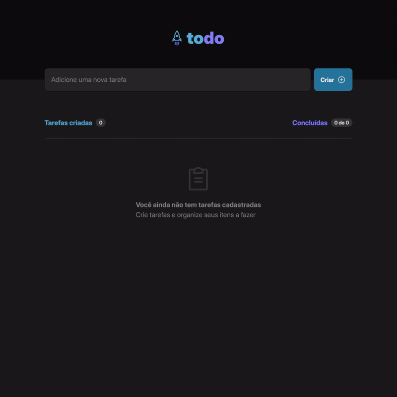
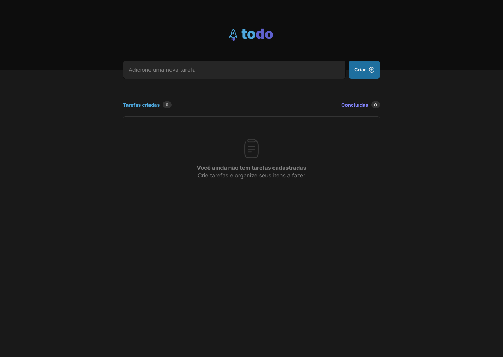
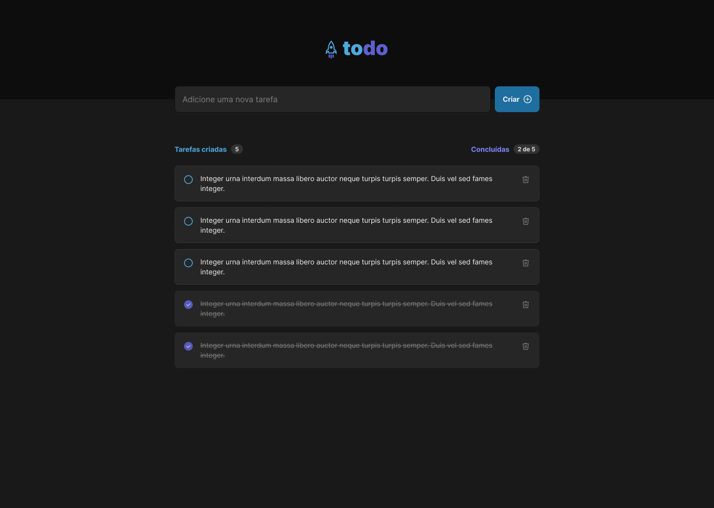
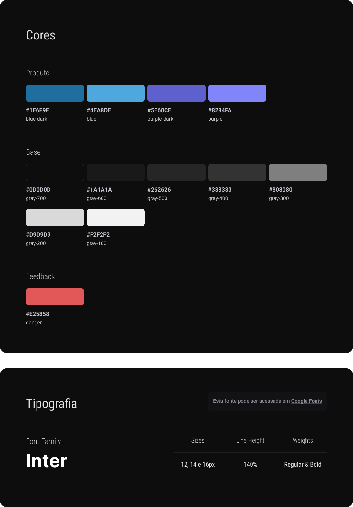
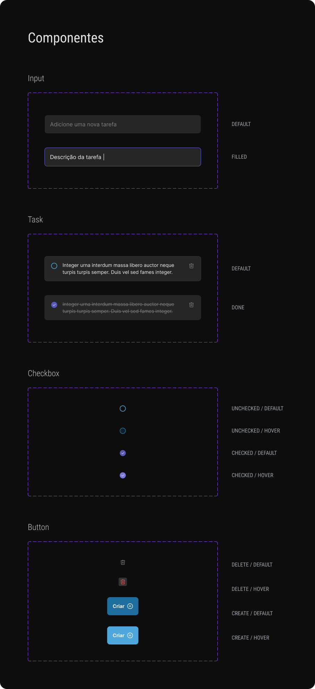

# RocketSeat - TodoList
Uma aplicação de lista de tarefas criada como parte de um curso de React da RocketSeat.

## Funcionalidades

- Adicionar novas tarefas
- Marcar tarefas como concluídas
- Excluir tarefas
- Interface responsiva

## Tecnologias Utilizadas

- React
- TypeScript
- Context API
- UUID
- Phosphor

## Instalação para rodar o projeto localmente: 
```bash
# Clone o repositório
git clone https://github.com/TheGorje/Rocketseat-TodoList.git

# Entre no diretório do projeto
cd Rocketseat-TodoList

# Instale as dependências
npm install

# Rode o projeto com o Vite
npm run dev
```

### Interface na Aplicação




# Layout da Aplicação (Figma)
- No desafio, foi fornecido um layout no Figma para que eu pudesse seguir e implementar todas as funcionalidades.
- Todos feitos pela [Millena Martins](https://www.linkedin.com/in/millenamartins/) Product Designer da RocketSeat.

### Layout




### Components



